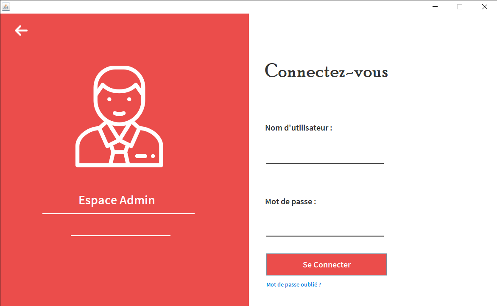
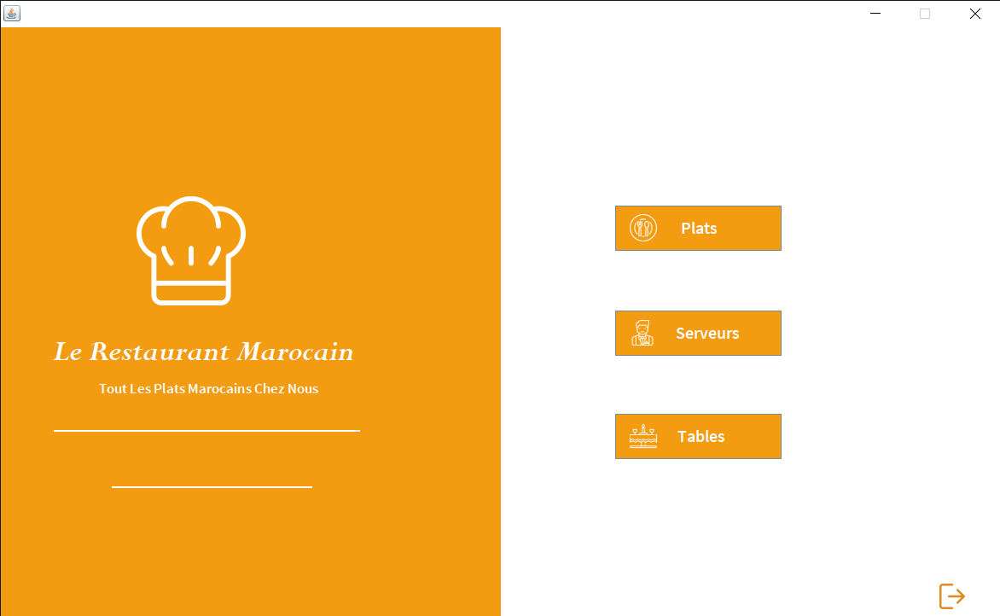
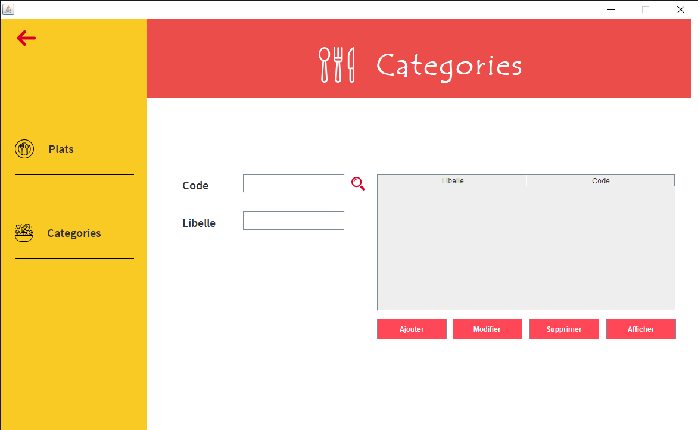
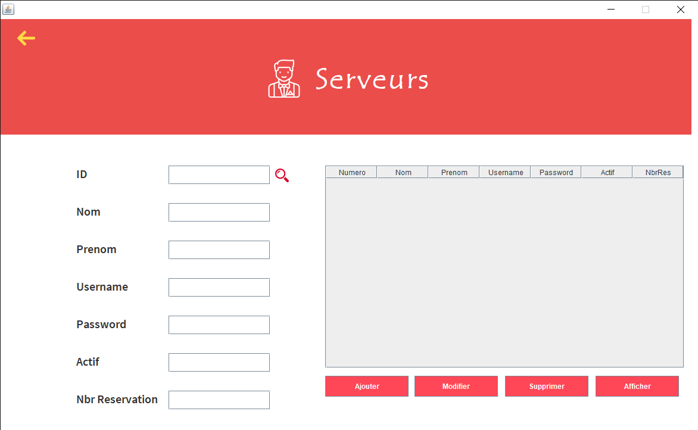
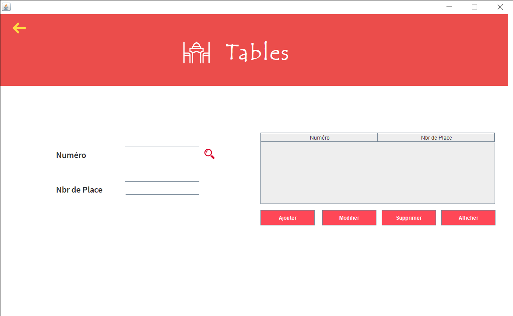
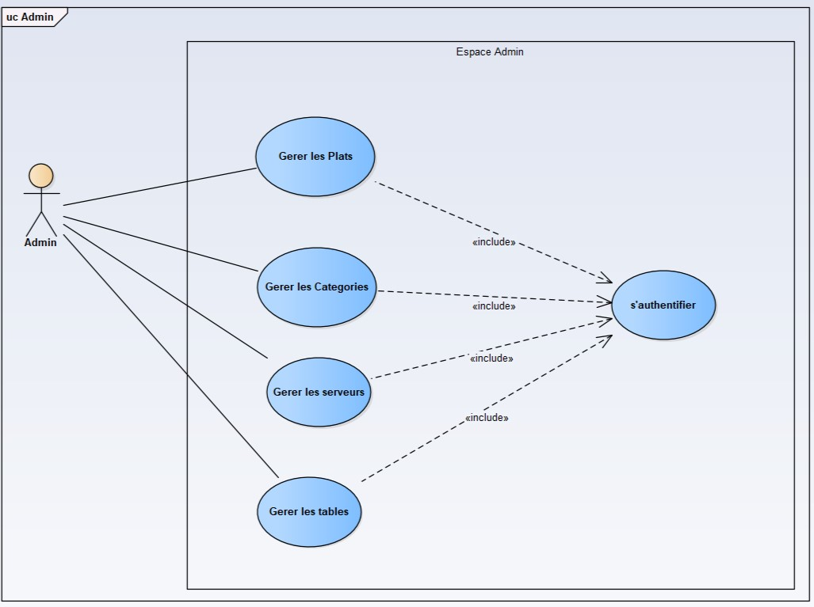
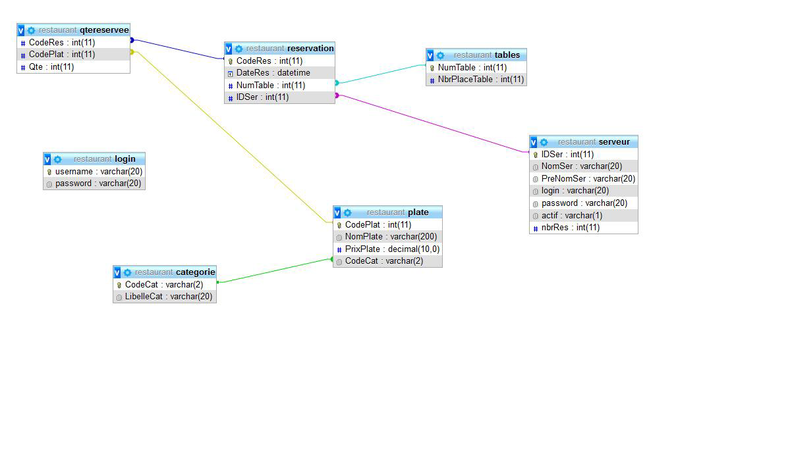

# Restaurant desktop Application


Java based Restaurant Management System that aims to digitalize the process of various restaurant management operations including updating menus, available tables ...

# How to use it ?

clone the project and import it to Eclipse IDE

```
git clone https://github.com/Otman404/Restaurant_Desktop.git
```

create the database (you will find tables and triggers .. in Database folder), change database connection username and password with yours and run it.

<b>Ps :</b> the project is in French (it was a school assignement)

# Interfaces

## Login

    
    
## Home



## Gestion des Plats


## Gestion des Categories



## Gestion des Serveurs


## Gestion des Tables



## use case diagram


## Data Base Diagram


# Contribution
If you found a bug,or have any improvement, please open an issue or try to propose a fix through a pull request
Thank you!
